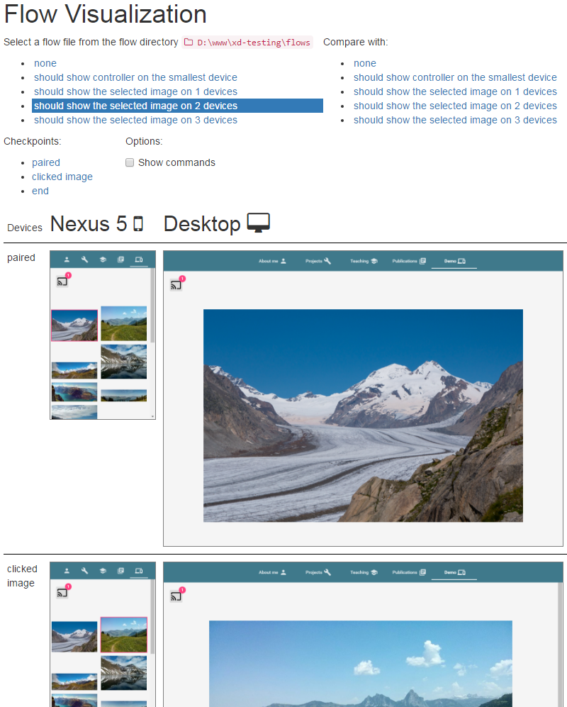

# XD-Testing

A testing library for cross-device (XD) web applications.
Based on [WebdriverIO](http://webdriver.io/) and uses the [Selenium](http://www.seleniumhq.org/) browser automation stack.
This project was developed at ETH Zurich by Michael Spiegel and supervised by Maria Husmann and Alfonso Murolo.

Here is an example test case using Mocha:

```javascript
var xdTesting = require('xd-testing')

// Use a Nexus 5 and a Desktop Chrome browser
var scenario = {
    "Nexus 5": xdTesting.templates.devices.nexus5,
    "Desktop": xdTesting.templates.devices.chrome
}
it('should show the selected image on any device', () => {
    return xdTesting.multiremote(scenario).init()
        .name('should show the selected image on any device')
        .app().pairDevicesViaURL(baseUrl)
        .checkpoint('pair devices')
        // Dynamically select any matching device to execute each command
        .any(device => device
            .click('.controller img:nth-of-type(2)')
            .waitForVisible('.viewer img[src="img/02.jpg"]', 10000)
        )
        .checkpoint('select image')
        .end()
})
```



## Installation

Install xd-testing via npm:

    npm install --save xd-testing

Additionally, the [selenium-standalone](https://www.npmjs.com/package/selenium-standalone) package and [Mocha](https://mochajs.org/) are recommended:

    npm install --save selenium-standalone mocha

You can also use any Selenium server package and test runner.
